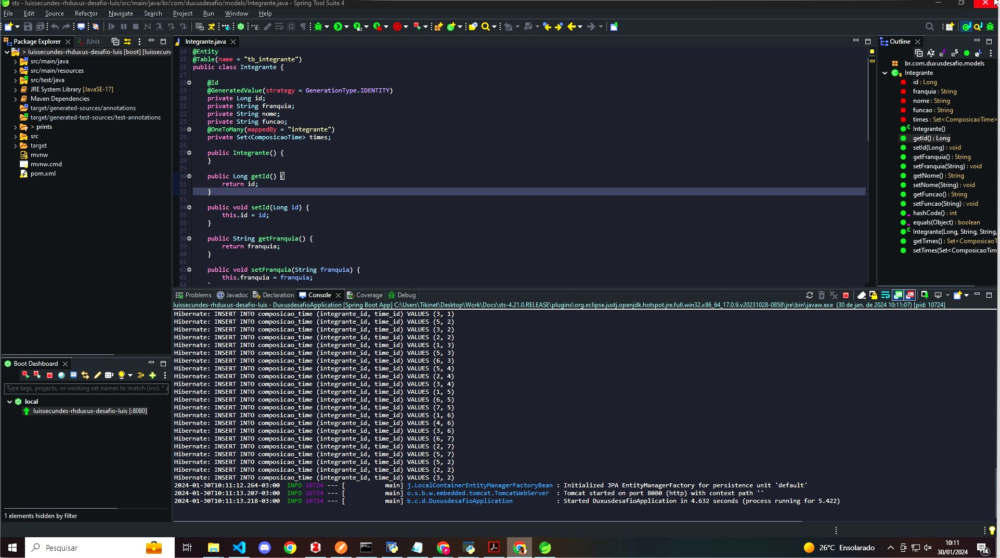
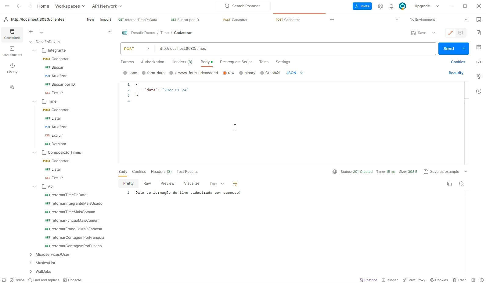
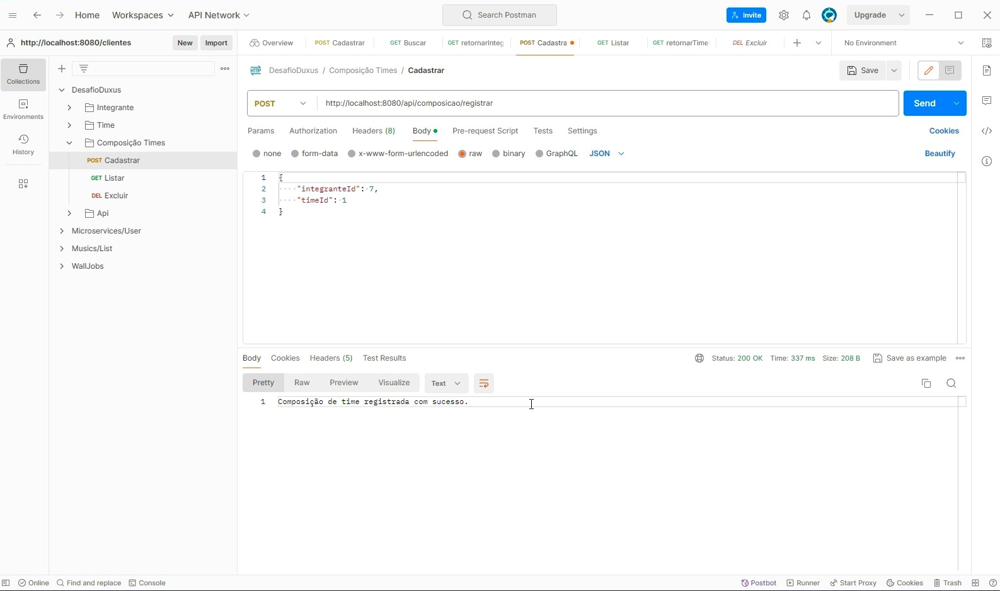

# Agradecimentos

Gostaria de agradecer pela equipe da DUXUS por permitir que eu participasse desse processo. Confesso que de tudo que eu já havia estudado e desenvolvido, este de longe foi o mais desafiador. No início achava que seria até simples quando li o enunciado e vi os métodos, mas a medida que fui desenvolvendo, claramente não era tão simples assim. Talvez um Dev. Sênior ou até mesmo Júnior mais experiente, provavelmente teria tirado isso de letra em algumas horas, mas para que eles alcançassem esse status, foi necessário empenho, dedicação e novos desafios, e a cada dia que passa sinto que estou mais próximo desse mesmo lugar onde outros chegaram, e esse projeto contribuiu muito para a minha evolução, tendo em vista que tive que usar alguns recursos que antes eu não conhecia tão bem.

De toda forma, mais uma vez, quero agradecer a todos, em especial ao Jackson que me deu toda a segurança possível para realizar o projeto da melhor forma e aos meus amigos que me ajudaram com dicas e puderam compartilhar um pouco da sua experiência comigo fazendo eu alcançar os objetivos. Talvez não seja o código mais otimizado, mais limpo, mais desacoplado ou talvez utilizando as melhores práticas, mas com certeza nesse código há toda a entrega da minha dedicação e do meu esforço. Obrigado Equipe Duxus! 

# Descrição do Sistema

O sistema **Ragnarok Legends** tem por objetivo auxiliar o gerenciamento da montagem de times para uma partida de Ragnarok Online. Nele você vai inserir integrantes da sua 'guild' *(o que seria o equivalente a um clã ou grupo de pessoas que se unirão em prol da partida)*, e após inserir os integrantes da Guild, você irá registrar as datas em que acontecerão as Guerras do Emperium. Após fazer ambos os registros, você poderá através do sistema fazer a composição de quem fará parte do seu time em cada dia de Guerra do Emperium e após fazer todos esses registros, o sistema irá permitir que você faça uma análise do seu time, buscando informações que serão relevantes para a sua estratégia de guerra como: Time da Data, Integrante Mais Usado, Time Mais Comum, Função Mais Comum, etc.

> *Obs*: A Guerra do Emperium, é um evento que acontece entre duas a três vezes por semana, onde vários clãs ou guilds se juntam com o objetivo de dominar os castelos disponíveis no jogo e conquistar o Emperium.

# Iniciando a aplicação

Antes de mais nada, certifique-se de que sua aplicação está rodando na porta: 8080 e de que o Hibernate também já fez a inserção no banco de dados H2. 

Em seguida abra o seu Postman e agora podemos começar a simular as requisições de cadastro de **Integrante**, **Times** e a **Composição de Times**. Para Integrante, Times e Composição de Times, algumas requisições serão passadas via JSON no Body da requisição. Irei deixar abaixo uma tabela com as URL's que estão disponibilizadas pelos Endpoints do Controller e um exemplo de JSON a ser passado.

## Informações do banco de dados H2

URL: http://localhost:8080/h2-console

JDBC URL: jdbc:h2:mem:testdb

Username: sa

Senha: *(Campo vazio / Em branco.)*

## Requisições Integrantes

| Método               | EXEMPLOS - URL                                                                           | JSON             |
|----------------------|------------------------------------------------------------------------------------------|------------------|
| findAll           | [http://localhost:8080/integrantes](http://localhost:8080/integrantes) | **NÃO É NECESSÁRIO**   |
| findbyId  | [http://localhost:8080/integrantes/5](http://localhost:8080/integrantes/5)     | **NÃO É NECESSÁRIO**   |
| save        | [http://localhost:8080/integrantes](http://localhost:8080/integrantes)       | {"franquia": "Franquia A", "nome": "Luis", "funcao": "Champion"}   |
| update      | [http://localhost:8080/integrantes/7](http://localhost:8080/integrantes/7)   | {"franquia": "Franquia B", "nome": "Amanda", "funcao": "Sumo-Sacerdote"}   |
| delete   | [http://localhost:8080/integrantes/4](http://localhost:8080/integrantes/4)      | **NÃO É NECESSÁRIO**   |

--------------------------------------------------------------------------------------------------------------------------------------

## Requisições Times

| Método               | EXEMPLOS - URL                                                                           | JSON             |
|----------------------|------------------------------------------------------------------------------------------|------------------|
| save    | [http://localhost:8080/times](http://localhost:8080/times)       | {"data": "2024-01-01"} |
| update  | [http://localhost:8080/times/7](http://localhost:8080/times/7)   | {"data": "2024-01-24"} |
| delete  | [http://localhost:8080/times/4](http://localhost:8080/times/4)   | **NÃO É NECESSÁRIO**   |

## Requisições Composição Times

| Método               | EXEMPLOS - URL                                                                           | JSON             |
|----------------------|------------------------------------------------------------------------------------------|------------------|
| save    | [http://localhost:8080/api/composicao/registrar](http://localhost:8080/api/composicao/registrar)       |  { "integranteId": 1, "timeId": 3 } |
| findAll  | [http://localhost:8080/api/composicao/integrantes?data=2024-01-03](http://localhost:8080/api/composicao/integrantes?data=2024-01-03)  | **NÃO É NECESSÁRIO** |
| delete  | [http://localhost:8080/api/composicao/deletar/1](http://localhost:8080/api/composicao/deletar/1)   | **NÃO É NECESSÁRIO**   |

## Requisições ApiService

• É importante dizer que elas podem ser testadas tanto no Swagger quanto no Postman. Por convenção, preferi a utilização do Postman pois estava com as uris prontas, portanto isso facilitou que eu teste por lá. 

• Já foi disponibilizado dentro do projeto um arquivo import.sql que está responsável por fazer o seed em todas as bases de dados que o sistema contém (Integrantes, Times e ComposicaoTimes).

> A base de dados de Integrantes, contém o registro do **NOME** cada integrante juntamente com a **FRANQUIA** que ele pertence e também a **FUNÇÃO/CLASSE** que ele irá usar para jogar a partida.

> A base de dados de Times, contém o registro das datas em que as partidas irão acontecer.

> A base de dados de ComposicaoTime, contém o registro dos times formados usando como base os dados de Integrantes e Times. Sendo assim, para cada data, há uma composição de times que é feita pelos integrantes já registrados em Integrantes.

## Métodos - ApiService   ||   URI passada no Postman 

• Vale lembrar que no caso dos métodos implementados na classe ApiService, foram utilizados RequestParams, portanto não há necessidade de passar nenhum JSON no corpo da requisição. Irei deixar abaixo as url's corretas como forma de exemplo para fazer as consultas através do Postman. No caso do uso de Swagger, o próprio Swagger disponibiliza um campo de data inicial e final. Só é importante lembrar de inserir no padrão que o JSON está recebendo que é sem formatação de local. 'yyyy-mm-dd'.

;D

| Método               | EXEMPLOS - URL                                                                           |
|----------------------|------------------------------------------------------------------------------------------|
| timeDaData           | [http://localhost:8080/api/buscartime?data=2024-01-21](http://localhost:8080/api/buscartime?data=2024-01-21) |
| integranteMaisUsado  | [http://localhost:8080/api/integranteMaisUsado?dataInicio=2024-01-01&dataFim=2024-01-31](http://localhost:8080/api/integranteMaisUsado?dataInicio=2024-01-01&dataFim=2024-01-31)     |
| timeMaiscomum        | [http://localhost:8080/api/timeMaisComum?dataInicio=2024-01-01&dataFim=2024-01-31](http://localhost:8080/api/timeMaisComum?dataInicio=2024-01-01&dataFim=2024-01-31)         |
| funcaoMaisComum      | [http://localhost:8080/api/funcaoMaisComum?dataInicio=2024-01-01&dataFim=2024-01-31](http://localhost:8080/api/funcaoMaisComum?dataInicio=2024-01-01&dataFim=2024-01-31)     |
| franquiaMaisFamosa   | [http://localhost:8080/api/franquiaMaisFamosa?dataInicio=2024-01-01&dataFim=2024-01-31](http://localhost:8080/api/franquiaMaisFamosa?dataInicio=2024-01-01&dataFim=2024-01-31) |
| contagemPorFranquia  | [http://localhost:8080/api/contagemPorFranquia?dataInicio=2024-01-01&dataFim=2024-01-31](http://localhost:8080/api/contagemPorFranquia?dataInicio=2024-01-01&dataFim=2024-01-31) |
| contagemPorFuncao    | [http://localhost:8080/api/contagemPorFuncao?dataInicio=2024-01-01&dataFim=2024-01-31](http://localhost:8080/api/contagemPorFuncao?dataInicio=2024-01-01&dataFim=2024-01-31)     |   

### Últimas Observações

> O método Excluir/Deletar tanto da tabela Integrantes quanto da tabela Times (que possui o registro de datas das formações de times), ambas só irão funcionar caso não houverem registros na tabela que as usa como referência que no caso é ComposicaoTime. Poderia ser usado o método de exclusão em castata que a annotation @ManyToOne fornece para ser passado como argumento, porém achei por bem não utilizar para previnir a exclusão indesejada de registros na tabela de Composição de Times.

